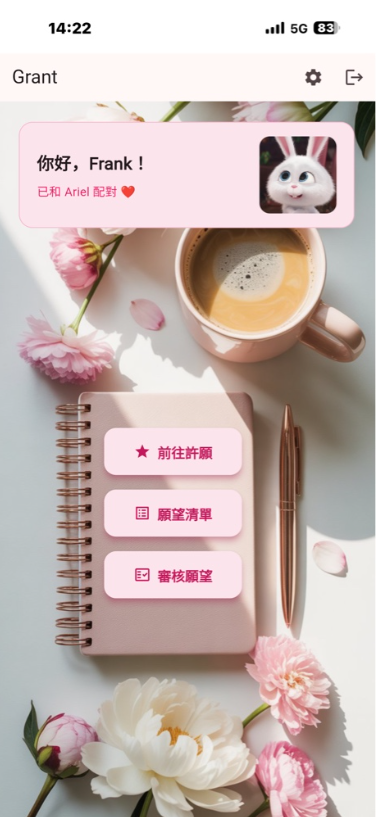
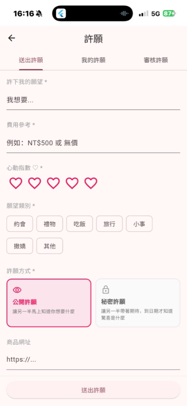

<div align="right">

**English** | [繁體中文](README.zh-TW.md)

</div>

# Grant 💝

[](https://github.com/frankkn/Grant/releases/tag/v1.16.0)
[](https://grant-45f5c.web.app)

A wish-making app for couples — pitch your wish with a heart-flutter rating and your best reasons, and convince your other half to make it come true.

---

## Getting Started

### Android
1. Download [app-grant.apk (latest)](https://github.com/frankkn/Grant/releases/latest/download/app-grant.apk)
2. On your phone, go to Settings → Security → enable "**Allow installation from unknown sources**"
3. Open the downloaded APK and install it
4. Launch Grant, then sign up or sign in with Google

### iOS (Add to Home Screen)
1. Open the [Grant web app](https://grant-45f5c.web.app) in **Safari**
2. Tap the "**Share**" button at the bottom center ↑
3. Scroll through the menu and choose "**Add to Home Screen**"
4. Tap "**Add**" in the top-right corner → a Grant icon appears on your home screen and works just like a native app

### Web
Open it directly in your browser: [https://grant-45f5c.web.app](https://grant-45f5c.web.app)

---

## Screenshots

<p align="center">
  
  &nbsp;&nbsp;
  
</p>

---

## Features

### Account
- Email sign-up / sign-in
- Google sign-in
- Set a nickname on first login
- Login state persists automatically

### Couple Pairing
- Generate a 6-digit pairing code (valid for 10 minutes)
- Enter your partner's code to pair up
- Unpair anytime from the Settings page

### Wish System (after pairing)
- Submit a wish with details: the wish itself, estimated cost, heart-flutter rating (❤️ x5), category, product URL, product description, persuasive reasons, and desired date
- Choose between a "**public wish**" and a "**secret wish**": before the unlock date, your partner only sees a mysterious hint — not the content
- Wish categories (Date / Gift / Food / Travel / Little Things / Affection / Other), with category filtering on lists
- View your own wish list; edit (while pending) or delete
- Tap any wish for full details and review results
- Review your partner's wishes: approve, **counter-propose** (negotiate), or reject — with an optional reply
  - Counter-proposal: submit your conditions; the wisher can accept or withdraw
- Browse reviewed wish history, filterable by category
- Mark approved wishes as "fulfilled" with a thank-you note
- **Memory Wall** with two tabs: "Timeline / Stats"
  - Timeline: a timeline of every fulfilled wish
  - Stats: fulfillment rate, wish counts and favorite categories for you vs. your partner, category rankings, average heart-flutter rating, and wish status distribution

### Anniversaries (after pairing)
- Manage anniversaries on the Settings page, with three types: "Together / Birthday / Custom" — editable by both partners
- The home page shows a countdown to the nearest anniversary; the "Together" type also shows how many days you've been together
- Both partners get an automatic push notification on the day itself

### Whispers (after pairing)
- A chat-style feed for sending messages to your partner, with an optional mood emoji
- Full history is kept; the home page shows your partner's latest whisper
- Instant push notification when your partner sends one

### Notifications
- Your partner is notified instantly when you submit a wish, post a review result, send a counter-proposal, or send a whisper
- Supported on Android and Web/PWA (including iOS after adding to home screen); on iOS PWA you need to grant permission once via "**Push Notifications**" on the Settings page
- Secret-wish notifications never reveal the content (they show "🔒 A secret wish is waiting for you…")
- Mystery wish unlock cards: the home page hints at secret wishes that are about to unlock or just unlocked (without spoiling the content)
- Anniversary-day and secret-wish-unlock notifications are sent automatically by a daily backend job (09:00)

### Other
- **Dark mode**: switch between System / Light / Dark under "Appearance" in Settings; your preference is remembered
- Background music (volume adjustable in Settings)
- Automatic update prompt when a new version is available (Web)

---

## Tech Stack

- **Framework**: Flutter (Android and Web)
- **Backend**: Firebase (Authentication, Cloud Firestore)
- **Push notifications**: Firebase Cloud Messaging + a Railway-hosted backend
- **Sign-in**: Firebase Auth Email/Password + Google Sign-In

## Development Environment

- Flutter 3.32+
- Dart 3.8+
- Android SDK 35
- Firebase project: `grant-45f5c`

## Running Locally

```bash
# Install dependencies
flutter pub get

# Run on the Android emulator
flutter run -d emulator-5554

# Run on Web (Chrome)
flutter run -d chrome --web-port 5000

# Build Android APK
flutter build apk --debug
```

---

## Changelog

| Version | Date | Changes |
|------|------|---------|
| v1.16.0 | 2026-07-05 | Bug fixes: fixed a date-picker crash when editing a wish whose date had already passed; push token now syncs immediately after login (fresh installs receive notifications from the very first login) and is removed on logout so signed-out devices no longer receive the partner's pushes; fixed the pairing document's createdAt being overwritten repeatedly, and a race where the Memory Wall could briefly show stale data during rapid consecutive updates; the Whispers page now uses a cached stream, reducing duplicate reads and screen flicker |
| v1.15.1 | 2026-06-11 | Added a speaker button next to Settings in the top-right of the home page for one-tap mute/unmute without opening Settings (muting remembers the previous volume and restores it on unmute; defaults to 50 if sound was never enabled); when reviewing a wish, a reply forgotten at approval time can still be added or edited afterwards (cannot be changed into a rejection) |
| v1.15.0 | 2026-06-10 | Push notifications in Settings are now a toggle: shows whether they are on, off, or blocked by the system, and lets you opt out (removes the device token so no more pushes are received); fixed anniversaries that could not be deleted (a single corrupt record no longer breaks batch add/delete); anniversary text reworded to "Day N together, X days until Name (MM/DD)" with the date included; home page layout overhaul — up to 3 anniversaries shown at the top (newest first, multiple allowed), whispers placed below the anniversaries or below the buttons depending on how many there are, and the buttons are now anchored so they no longer shift with hint counts or loading; fixed blank notification text for secret-wish review/negotiation pushes and made the nickname required at sign-up; performance and stability: merged duplicate Firestore subscriptions, cached secret-wish content reads, and hardened data-parsing fault tolerance |
| v1.14.0 | 2026-06-10 | Fixed whisper mood emoji rendering as grayscale outlines on first load in Web/PWA — the mood picker row, message bubbles, and the home page's latest-whisper banner now use bundled color images instead of relying on on-the-fly browser font downloads; approved/rejected wishes in "My Wishes" no longer show edit and delete buttons (the delete button used to appear erroneously and do nothing when tapped), and failed deletions now show a clear error |
| v1.13.0 | 2026-06-10 | Enabled push notifications for Web/PWA (including iPhone Add to Home Screen) — previously Android-only; iOS PWA users can now receive whisper and wish pushes after granting permission once via "Push Notifications" in Settings (added a Web Push key, an FCM service worker, and a gesture-triggered permission request); fixed the "Review Wishes" tab getting stuck on "Loading…" instead of settling on "No wishes pending review" when there was nothing to review |
| v1.12.0 | 2026-06-09 | When a secret wish reaches its unlock time, the red badge, unlock hint, and review list now update automatically without restarting the app; further optimized the home page's realtime subscriptions (review badge and user data share a stream), reducing duplicate reads and badge flicker; fine-tuned the vertical position of the home page notebook buttons; removed unused code |
| v1.11.0 | 2026-06-08 | Stability and polish: fixed the thank-you note lingering on screen after un-marking a wish as "fulfilled", and unpairing failing entirely when the partner had already re-paired; hardened wish-status parsing (a single corrupt record no longer breaks the whole list); optimized realtime subscriptions to cut unnecessary reads and screen flicker; home page notebook button moved back to dead center vertically (50%) |
| v1.10.2 | 2026-06-07 | Fresh installs now default to the light theme (previously followed the system; still switchable in Settings); home page notebook button nudged to 51% vertically (was 52%) |
| v1.10.1 | 2026-06-06 | UI polish: the home page notebook buttons are narrower and tucked within the notebook's bounds (width, spacing, and vertical padding adjusted) for a more balanced layout |
| v1.10.0 | 2026-06-06 | Privacy and stability hardening: secret-wish content moved into a protected subcollection so the partner cannot read it at all before the unlock date (enforced by database rules, not just hidden in the UI); only "approved" wishes can be marked as fulfilled; fixed a timezone offset in secret-wish unlock pushes (no more firing a day early), Feb 29 anniversaries not reminding in non-leap years, and the unlock countdown display; improved first-login push-token write resilience and the backend's daily push query performance |
| v1.9.0 | 2026-06-06 | Security and stability hardening: pushes can now only be sent to your "current partner" (backend-authorized, preventing notification abuse); more robust pairing flow — leftover pairing codes are cleared automatically after a successful pairing, expired codes are cleaned up daily on the backend, and error responses are more consistent; technical error messages shown during network/gateway failures replaced with friendly ones |
| v1.8.0 | 2026-06-06 | Security hardening: push and pairing requests are now identity-verified on the backend (Firebase ID Token), with new Firestore security rules blocking unauthorized reads/writes; the pairing flow is handled atomically by the backend for greater reliability; fixed potential crashes from unreleased page resources and async state in several places, and hardened user-data parsing |
| v1.7.0 | 2026-06-05 | Added a "Stats" tab to the Memory Wall (fulfillment rate, you vs. your partner, category rankings, average heart-flutter rating, status distribution); added dark mode (Appearance switcher in Settings with remembered preference); localized date formatting to "2026年6月5日" |
| v1.6.0 | 2026-06-05 | Added anniversary countdowns (Together / Birthday / Custom, with a countdown banner on the home page), the Whispers feed (chat-style messages + moods), and mystery wish unlock cards; pushes now cover review results, counter-proposals, and new whispers, and the backend gained daily scheduled pushes (anniversary days and secret-wish unlock days) |
| v1.5.1 | 2026-06-02 | Fixed home page button taps not triggering the background music (Web autoplay policy caused the GestureDetector to be intercepted by child buttons) |
| v1.5.0 | 2026-06-02 | Fixed pairing safeguards (already-paired users can no longer pair again, preventing one-sided pairing orphans), wishes and the Memory Wall now filter correctly by current partner, secret wishes no longer leave the review badge stuck, "Remember me" wired up to login persistence, and Memory Wall timeline display fixes; added 12 unit tests |
| v1.4.0 | 2026-06-02 | Filters redesigned as a collapsible panel (dual category + status filters, with a summary shown when collapsed); fixed inconsistent card heights between public and secret wishes and category filter chips being truncated |
| v1.3.0 | 2026-06-02 | Added the wish negotiation flow (counter-proposal / accept / withdraw), wish categories with filtering, public / secret wish modes, and Memory Wall category stats; fixed a crash when filtering reviewed wishes by category |
| v1.2.4 | 2026-06-01 | Approved wishes gained a "fulfilled" checkbox that can be toggled and is saved in sync |
| v1.2.3 | 2026-06-01 | Added nickname editing on the Settings page; fixed the PWA update-prompt mechanism |
| v1.2.2 | 2026-05-31 | Dramatically reduced APK size (about 204MB → 56MB) for faster downloads; switched to a fixed signing key so future updates install over the existing app without reinstalling |
| v1.2.1 | 2026-05-31 | Removed the "Status:" prefix from the pairing status; web deployment now happens automatically per version tag |
| v1.2.0 | 2026-05-31 | Home page redesign (three notebook buttons), pairing status shows the partner's name, pending-review wish count badges (home page and review tab), responsive layout for wide screens, and version number shown on the Settings page |
| v1.1.0 | 2026-05-30 | Fixed the submit-wish button being hidden by the keyboard, added a success popup on submission, added a hint for non-Safari browsers on iOS, renamed the APK to app-grant.apk, and set up automated releases via GitHub Actions |
| v1.0.0 | 2026-05-30 | Initial release: couple pairing, the wish system, push notifications, background music, and the Web version |
